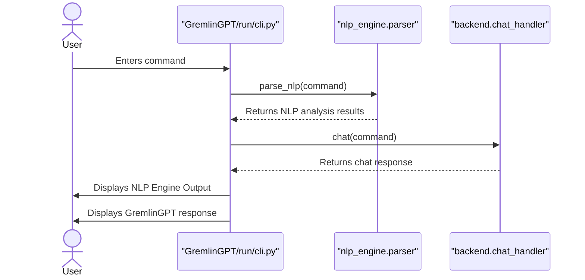
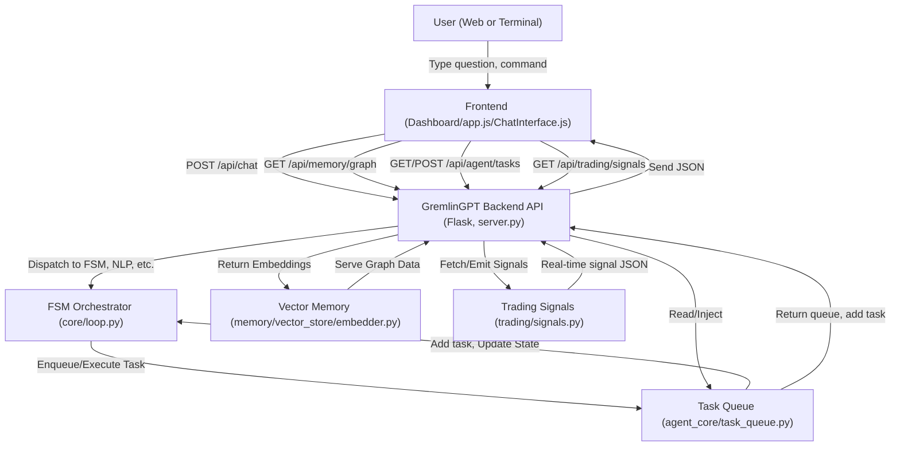

<link rel="stylesheet" type="text/css" href="docs/custom.css">
<div align="center">
  <a
href="https://github.com/statikfintechllc/AscendAI/blob/master/About Us/LICENSE">
    
  </a>
  <a href="https://github.com/statikfintechllc/AscendAI/blob/master/About Us/LICENSE">
    
  </a>
</div>

<div align="center">
  <a
href="https://github.com/statikfintechllc/AscendAI/blob/master/About Us/WHY_GREMLINGPT.md">
    
  </a>
  <a href="https://github.com/statikfintechllc/AscendAI/blob/master/About Us/WHY_GREMLINGPT.md">
    
  </a>
</div>

  <div align="center">
  <a href="https://ko-fi.com/statikfintech_llc">
    
  </a>
  <a href="https://patreon.com/StatikFinTech_LLC?utm_medium=unknown&utm_source=join_link&utm_campaign=creatorshare_creator&utm_content=copyLink">
    
  </a>
</div>

<h1 align="center">GremlinGPT: The Real Autonomous Agent v1.0.3</h1>

<h3 align="center"><em>The world’s first R‑SRACS</em></h3>
<h4 align="center">*Recursive, Self-Referential Autonomous Cognitive System*</h4>

<p align="center">
GremlinGPT is a Recursive, Self-Referential Autonomous Cognitive System (R‑SRACS), deployable as a Decentralized Autonomous Intelligence Node (DAIN) with multi-agent Emergent Network properties (EMAN) and a Meta-Synthetic Persona Engine (MSPE) interface.
</p>

<div align="center">
  <a href="https://github.com/statikfintechllc/AscendAI/blob/master/GremlinGPT">
    
  </a>
  <a href="https://github.com/statikfintechllc/AscendAI/blob/master/About Us/FOUNDER_LOG.md">
    
  </a>
  <br/>
  <a href="https://github.com/statikfintechllc">
    
  </a>
  <a href="https://github.com/statikfintechllc/AscendAI/blob/master/About Us/FOUNDER_STATEMENT.md">
    
  </a>  
</div>
<div align="center">
  <a
href="https://github.com/statikfintechllc/AscendAI/blob/master/GremlinGPT/docs/GREMLINGPT_AUTONOMY_REPORT.md">
    
  </a>
  <a href="https://github.com/statikfintechllc/AscendAI/blob/master/GremlinGPT/docs/GREMLINGPT_AUTONOMY_REPORT.md">
    
  </a>
</div>

---

<h1 align="center">AscendAI Traffic</h1>
<div align="center">
  <a href="https://raw.githubusercontent.com/statikfintechllc/AscendAI/main/docs/traffic_graph.png">
  
  </a>
</div>
  
<div align="center">
  <em>
Reset: After 7:00pm CST on First 2 Clones
  </em>
</div>

---

<div align="center">
  <em>
    This isn’t a dev team. It’s not a startup. It’s not polished.  
    This is one person, black coffee, and belief.  
    What usually takes a small army of engineers and millions in funding —  
    I pulled from the void with no budget and no training.  
    Now the system almost lives, breathes, and boots(70%).  
    It needs testers. Attackers. Real Gremlins.  
    If you can read the repo and feel it watching you back, you're already in. 
  </em>
</div>

---

## Table of Contents

- [Founder's Log & Manifesto](#founders-log--manifesto)
- [Overview](#overview)
- [Reviewer's Guide](#reviewers-guide)
- [Features](#features)
- [Architecture](#architecture)
- [System Components](#system-components)
- [Installation](#installation)
- [Running the System](#running-the-system)
- [Remote Access using ngrok](#remote-access-using-ngrok)
- [API Endpoints](#api-endpoints)
- [Recovery & Snapshots](#recovery--snapshots)
- [Troubleshooting](#troubleshooting)
- [System Infrastructure](#system-infrastructure)
- [License](#license)

---

## Founder's Log & Manifesto

> I built an AI system that builds itself.  
> Not in a lab.  
> Not at a venture-backed startup.  
> Not on fiber internet with a dev team holding my hand...

Read the [FOUNDER_LOG.md](https://github.com/statikfintechllc/AscendAI/blob/master/About%20Us/FOUNDER_LOG.md) and the [FOUNDER_STATEMENT.md](https://github.com/statikfintechllc/AscendAI/blob/master/About%20Us/FOUNDER_STATEMENT.md) for the full journey and philosophy.

---

## Overview

**GremlinGPT** is a fully local, modular, self-evolving AI agent platform—**no cloud**, **no external APIs**, no hidden data leaks.

- Autonomous FSM-driven agent loop
- Self-wiring NLP/memory stack (Chroma/FAISS)
- DOM/web/stock scraper, persistent trading signals, recursive self-training
- Bulletproof, production-grade, **red/black/gold/silver-themed** PWA dashboard for chat, tasks, memory, and trading

---

## Reviewer's Guide

### Sequence Diagram for CLI Interaction (Represetation is for the Cli.py for chat, not the App icon interaction.)

> *For those who dont want to wait on the dashboard to be buttoned and all pieces connedted.*



---

## Features

🗣️ *NEW LINUX APP ICON*
- **Zero cloud dependence**: runs 100% offline and local
- **Persistent, auto-recovering agent core**
- **State-of-the-art PWA dashboard**: mobile + desktop, instant install, works offline
- **Floating chat (always-on), tabbed navigation** (Tasks / Memory / Trading)
- **Self-training and auto-mutation**: logs errors, auto-patches, and retrains
- **Signal/ticker scanner**: EMA, VWAP, breakout, penny stock focus
- **Vector memory with UMAP, metadata, tagging**
- **Remote access with ngrok for secure AI on the go**
- **Auto-saving, crash recovery, and live snapshotting**

---

## Architecture

- **Linux Application** After install.sh is ran, linux users can check thier local app menu for AscendAR app icon.
- **Backend:** Python (Flask/FastAPI), persistent vector DBs, FSM agent loop
- **Frontend:** Modern PWA (Bootstrap, vanilla JS), custom dark theme, tabbed UI, floating chat
- **Memory:** Chroma, FAISS, SentenceTransformer, full vector store, auto-index
- **Scraper:** Playwright, BeautifulSoup, async router, DOM/stock/ticker feeds
- **Trading Core:** Real-time signal inference, estimator, audit/history
- **Self-training:** Log watcher, mutation engine, agent self-healing
- **All panels and actions call live REST endpoints—no stubs, no nulls**

---

## System Components

- **backend/**: API router, task/memory planners, logs, and snapshots
- **agent_core/**: Task queue, FSM/agent logic, tool dispatcher
- **nlp_engine/**: Tokenizer, transformer, parser, mutation diff
- **memory/**: Chroma/FAISS vector DB, metadata, embeddings
- **scraper/**: DOM navigator, Playwright, async router
- **self_training/**: Watchdog, feedback ingestion, retrainer
- **trading_core/**: Stock scanner, signal/rule engine, estimator
- **frontend/**: PWA dashboard (chat, tasks, memory, trading)

---

## Installation

**1. Clone the repo**

```bash
git clone https://github.com/statikfintechllc/AscendAI.git
cd AscendAI/GremlinGPT
```

**2. Install Conda environments**

```bash
cd conda_envs && chmod +x create_envs.sh && ./create_envs.sh
```

**Or**

```bash
cd .. && chmod +x install.sh && ./install.sh
```

**3. Bootstrap NLP models (one time)**
> *install.sh is going to complete all installs, this is soon debunk*

```bash
conda activate gremlin-nlp
python -c "from transformers import AutoTokenizer, AutoModel; AutoTokenizer.from_pretrained('bert-base-uncased'); AutoModel.from_pretrained('bert-base-uncased')"
python -c "from sentence_transformers import SentenceTransformer; SentenceTransformer('all-MiniLM-L6-v2')"
```

⸻

## 🧠 Running the System

> If you’re seeing errors from NLTK (e.g. punkt not found), don’t panic—you don’t have to go spelunking into site-packages anymore.

1. **Set your working directory**

```bash
cd /path/to/AscendAI/GremlinGPT
```

2. **Activate your NLP environment**
   
```bash
conda activate gremlin-nlp
```

3. **Run GremlinGPT CLI with NLP setup auto-wired**

*Inside run/cli.py, make sure this line appears near the top:*

```python
from utils.nltk_setup import setup_nltk_data
setup_nltk_data()
conda deactivate
```

**Then *run* the system**:

```python
PYTHONPATH=$(pwd) python3 run/cli.py
```

- This means NLTK will always look for standard punkt data.

Then:

> *still debugging the nlp_engine/, but aye, I turn wrenches 12 hours a day, and I almost have a custom built AI talking, and HELLA updates to modules and Fucntions in progress*

```bash
conda activate gremlin-nlp && PYTHONPATH=$(pwd) python3 run/cli.py
```

### Full System Launch:
> *Properly adjust this 'export PYTHONPATH="/path/to/AscendAI/GremlinGPT"' inside run/start_all.sh*

```bash
cd GremlinGPT
chmod +x run/start_all.sh
./run/start_all.sh
```

- Backend server launches (Flask or FastAPI, port 8000 or 8080)
- FSM agent loop, task queue, memory, scraper all start
- **Dashboard ready at:** http://localhost:8080/

⸻

## Remote Access using ngrok

- **To securely access GremlinGPT dashboard from anywhere:**
> *start_all.sh takes care of this*

```bash
ngrok http 8080
```

- Use the HTTPS URL provided by ngrok in your browser or mobile
- Full dashboard, all agent controls, remote chat and signal monitoring

⸻

## API Endpoints

- All dashboard features are live-wired to these REST endpoints:



⸻

## Recovery & Snapshots

- **Auto-saves:**
- Agent state, task queue, memory embeddings

**Key locations:**
- run/checkpoints/state_snapshot.json (full system snapshot)
- 
- run/checkpoints/task_queue.json (queue state)

**Recovery:**
- On crash/reboot, system auto-restores FSM, queue, and memory

**Manual monitoring:**

```bash
tail -f run/logs/runtime.log
```

⸻

## Troubleshooting

- Port conflict? Change in config.yaml or stop existing service
- Scraper fails? Set headless=False in playwright_handler.py and retry
- No memory? Verify embedder paths and Chroma/FAISS setup
- Training loop not updating? Run retrainer manually or inspect watchdog logs

⸻

## System Infrastructure

**Docs:**
*See [docs](https://github.com/statikfintechllc/AscendAI/blob/master/GremlinGPT/docs) for:*

- System architecture (system_overview.md)
- Module tree (full_structure_tree.txt)
- Agent logic (fsm_architecture.md)
- Memory/embeddings (memory_pipeline.md)
- Trading rules/signals (trading_signals.md)
- Self-training (self_training.md)
- Remote ops (ngrok_integration.md)
- Daemon/service setup (gremlin.service.md)
- Automated shell scripting (automated_shell.md)

**Live system trace:**

```bash
python run/module_tracer.py
```

⸻

## License

<div align="center">
  <a href="https://github.com/statikfintechllc/AscendAI/blob/master/About Us/LICENSE.md">
    
  </a>
  <a href="https://github.com/statikfintechllc/AscendAI/blob/master/About Us/LICENSE.md">
    
  </a>
</div>

FAIR USE for research, non-commercial, and education.
Contact for commercial/enterprise licensing.
© 2025 StatikFintechLLC / AscendAI Project.

